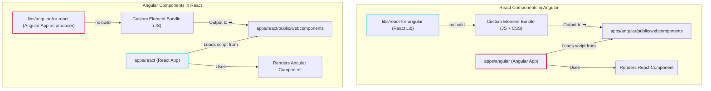

# Angular and React integration workspace

This repository is a comprehensive demonstration of bidirectional integration between Angular and React applications within an Nx monorepo. It showcases how to seamlessly use components from one framework within the other, leveraging modern web technologies like custom elements and framework-specific best practices.

## Table of Contents

- [Architecture overview](#architecture-overview)
- [Project overview](#project-overview)
- [Key features and benefits](#key-features-and-benefits)
- [Workspace structure](#workspace-structure)
- [Getting started](#getting-started)
  - [Prerequisites](#prerequisites)
  - [Installation](#installation)
- [Running the applications](#running-the-applications)
  - [Exploring the demos](#exploring-the-demos)
- [How it works](#how-it-works)
  - [Angular components in React](#angular-components-in-react)
  - [React components in Angular](#react-components-in-angular)
- [Build configuration](#build-configuration)
  - [React components for Angular](#react-components-for-angular)
  - [Angular components for React](#angular-components-for-react)
- [Build order for production](#build-order-for-production)
- [Enabling technologies and concepts](#enabling-technologies-and-concepts)
  - [Custom elements (web components)](#custom-elements-web-components)
  - [Dynamic imports and lazy loading with `MutationObserver`](#dynamic-imports-and-lazy-loading-with-mutationobserver)
  - [Sharing global context and services](#sharing-global-context-and-services)
  - [CSS handling for React web components](#css-handling-for-react-web-components)
  - [CSS variables for theming and styling](#css-variables-for-theming-and-styling)
  - [State management and communication patterns](#state-management-and-communication-patterns)
  - [Alternative approaches](#alternative-approaches)
- [Advanced topics and production use cases](#advanced-topics-and-production-use-cases)
  - [Incremental migration](#incremental-migration)
  - [Micro-frontends](#micro-frontends)
  - [Integrating with legacy systems](#integrating-with-legacy-systems)
  - [Sharing React providers and context](#sharing-react-providers-and-context)
  - [Optimization tips](#optimization-tips)
  - [Production considerations: `zone.js` and polyfills](#production-considerations-zonejs-and-polyfills)

## Architecture overview

The core architectural principle is to maintain a clean separation between the frameworks. Neither application directly depends on the other's source code or packages. Instead, integration is achieved by compiling libraries into framework-agnostic web components (custom elements) and consuming them via simple script tags.

This approach ensures that you can develop, test, and build each application independently, without creating a complex web of cross-framework dependencies.



- **Angular components in React**: The `angular-for-react` app is built as a standard application, but it also registers its components as custom elements. The `react` app then loads a single JavaScript bundle from the Angular build and can use its components (e.g., `<ngx-charts>`) as if they were native HTML elements.
- **React components in Angular**: Similarly, the `react-for-angular` library is configured with Vite to compile React components into a web component format that the `angular` application can consume.


## Project overview

The primary goal of this workspace is to provide a clear, working example of:

1.  **Angular components in a React app**: Exposing Angular components (including those using third-party libraries) as standard custom elements (web components) and consuming them in React.
2.  **React components in an Angular app**: Wrapping React components so they can be easily used within an Angular application, complete with property and event binding.
3.  **Nx monorepo best practices**: Structuring the applications and shared libraries in a clean, maintainable, and scalable way using Nx.

## Key features and benefits

- **Bidirectional integration**: Seamlessly use components across both frameworks.
- **Clean dependencies**: No cross-framework imports are required, preventing version conflicts and bundling issues.
- **Standard web components**: The integration is built on web standards, making it future-proof and compatible with other frameworks like Vue or Svelte.
- **Attribute-based prop passing**: Data is passed to Angular custom elements exclusively through attributes, ensuring robustness and simplicity. Stringified JSON is used for complex objects.
- **Type-safe usage**: TypeScript declarations are provided for custom elements, enabling full type-safety and autocompletion in the React JSX.
- **Incremental migration**: This architecture is ideal for gradually migrating a legacy application or integrating micro-frontends from different teams.
- **Nx-powered**: Built with Nx for powerful code generation, dependency management, and task running.

## Workspace structure

The monorepo is organized into applications (`apps`) and libraries (`libs`) to maintain a clean separation of concerns.

```text
angular-x-react/
├── apps/
│   ├── angular/              # Main Angular application
│   │   └── public/           # Hosts compiled React web components
│   └── react/                # Main React application
│       └── public/           # Hosts compiled Angular web components
│
├── libs/
│   ├── angular-for-react/    # Source for Angular components exposed as Elements
│   └── react-for-angular/    # Source for React components exposed as Elements
│
└── README.md
```

| Project                 | Path                               | Description                                                                                                                               |
| ----------------------- | ---------------------------------- | ----------------------------------------------------------------------------------------------------------------------------------------- |
| `angular`               | `apps/angular/`                    | The primary **Angular application**. It consumes web components built from the `react-for-angular` library.                                 |
| `react`                 | `apps/react/`                      | The primary **React application**. It consumes web components built from the `angular-for-react` library.                                   |
| `angular-for-react`     | `libs/angular-for-react/`          | An Angular application project that compiles its components into a standalone bundle of custom elements. It includes logic for lazy-loading and registering these elements for consumption in the React app. |
| `react-for-angular`     | `libs/react-for-angular/`          | A React library whose components are compiled into custom elements for Angular to use.                                                    |

## Getting started

### Prerequisites

- [Node.js](https://nodejs.org/) (v22 or later recommended)
- [Yarn](https://yarnpkg.com/) (v4.9 or later)

### Installation

1.  Clone the repository:

  ```sh
  git clone https://github.com/cisstech/angular-x-react
  cd angular-x-react
  ```

2.  Install the dependencies using Yarn:

  ```sh
  yarn install
  ```

## Running the applications

You can run both the Angular and React applications simultaneously to see the integration in action.

### 1. Serve the Angular app

The Angular app needs to be running to serve the custom elements that the React app will consume.

```sh
yarn serve:angular
```

The Angular application will be available at `http://localhost:4200/`.

### 2. Serve the React app

In a new terminal, run the React application:

```sh
yarn serve:react
```

The React application will be available at `http://localhost:4201/`.

### Exploring the demos

Once both applications are running, you can explore the integrations in both directions.

#### Angular components in React demo

Navigate to the **React app** at `http://localhost:4201/`. You will find a dropdown menu to switch between different integration examples:

1.  **Hello world component**: A basic example showing an Angular component (`ngx-hello-world`) that accepts a `name` string attribute from React. You can type into the input field in the React UI, and the change is instantly reflected in the Angular component.
2.  **NGX-Charts component**: A more advanced example demonstrating an Angular component (`ngx-charts`) that uses the popular `@swimlane/ngx-charts` library. This component receives its configuration and data as stringified JSON attributes, showcasing how to pass complex objects from React to an Angular custom element.

#### React components in Angular demo

Navigate to the **Angular app** at `http://localhost:4200/`. Here you will see a React component (`<react-hello-world>`) rendered inside the Angular application. This demonstrates the reverse integration, where a React component, compiled as a custom element, is seamlessly used within Angular.

#### Live demo on GitHub Pages

Go to the [GitHub Pages demo](https://cisstech.github.io/angular-x-react/) to see react and angular apps in action without needing to run the applications locally.

## How it works

### Angular components in React

1.  **Creation**: Angular components are created as usual (e.g., `NgxChartsComponent`). They use Angular's `signal` inputs to receive data.
2.  **Registration**: In `apps/angular/src/main.ts`, Angular's `createCustomElement` function from `@angular/elements` is used to wrap the Angular components into custom elements.
3.  **Consumption**: In the React app (`apps/react/src/app/app.tsx`), the custom elements (`<ngx-hello-world>`, `<ngx-charts>`) are used like regular HTML tags. The components are made available because the compiled Angular script is loaded in `apps/react/index.html`.
4.  **Data passing**: Props are passed as attributes. For complex objects (like chart data), the React app uses `JSON.stringify()` to pass the data as a string, and a custom `coerceObject` utility on the Angular side parses it back into an object.
5.  **Type safety**: A `global.d.ts` file in the React app declares the custom elements and their attributes to JSX, providing type checking and IntelliSense.

### React components in Angular

The `react-for-angular` library is set up to facilitate this. The process involves:

1.  Creating a React component.
2.  Using the `register` utility in the library to wrap the React component, making it available to Angular.
3.  Consuming the wrapped component in an Angular template.

## Build configuration

The magic of this integration lies in the build configuration. Each framework's build process is set up to place its compiled output directly into the `public` directory of the consuming application. This ensures that the web components are available at runtime without complex module federation or linking.

### React components for Angular

The `react-for-angular` library uses a custom Vite configuration to build its React components and output them directly into the Angular app's public assets directory.

Here is the relevant section from `libs/react-for-angular/vite.config.ts`:

```typescript
// libs/react-for-angular/vite.config.ts

export default defineConfig(() => ({
  // ... other config
  build: {
  // This is the crucial part:
  // The output directory is set to the 'public' folder of the Angular app.
  outDir: '../../apps/angular/public/react-for-angular',
  emptyOutDir: true,
  // ...
  rollupOptions: {
    input: 'src/index.ts',
    output: {
    // I specify a fixed output filename to make it easy to reference
    // in Angular's index.html.
    entryFileNames: 'index.js',
    format: 'esm',
    // ...
    },
  },
  },
  // ...
}));
```

This configuration tells Vite to compile the React components into a single JavaScript file and place it at `apps/angular/public/react-for-angular/index.js`. The Angular app can then load this script like any other static asset.

### Angular components for React

A similar strategy is used for the Angular components. The `angular` application's build configuration in `project.json` is modified to place the compiled custom elements into the React app's `public` directory.

Here is the relevant section from `apps/angular/project.json`:

```json
// apps/angular/project.json

{
  "name": "angular",
  // ...
  "targets": {
  "build": {
    "executor": "@angular/build:application",
    "outputs": ["{options.outputPath}"],
    "options": {
      // The output path is redirected to the React app's public folder.
      "outputPath": {
        "base": "apps/react/public/webcomponents",
        "browser": ""
      },
      "browser": "apps/angular/src/main.ts",
      // ...
    },
    "configurations": {
    "production": {
      // In production, output hashing is enabled to ensure unique filenames
      // for cache-busting.
      "outputHashing": "all"
    },
    "development": {
      // In development, hashing is disabled for predictable filenames.
      "outputHashing": "none"
    }
    },
    // ...
  }
  }
}
```

This setup ensures that when you build the `angular` app, its output (the JavaScript bundle containing the custom elements) is placed in `apps/react/public/angular-for-react/`. The React app's `index.html` can then include this bundle with a simple `<script>` tag, making the Angular components available for use.

## Build order for production

To create production-ready bundles for the applications and libraries, you must build them in the correct order: **producers first, then consumers**.

1.  **Build the `react-for-angular` library**: This creates the web components for the Angular app.

  ```sh
  yarn build:react-for-angular
  ```

2.  **Build the `angular-for-react` app**: This creates the web components for the React app.

  ```sh
  yarn build:angular-for-react
  ```

3.  **Build the `angular` application**: This creates the web components for the React app.

  ```sh
  yarn build:angular
  ```

4.  **Build the `react` application**: This builds the final React app, which now includes the Angular components.

  ```sh
  yarn build:react
  ```

After running these commands, the `dist/` folder will contain the production-ready applications.

## Enabling technologies and concepts

This repository demonstrates a powerful pattern for framework interoperability, relying on a combination of modern web standards and smart build configurations.

### Custom elements (web components)

The core of the integration lies in [custom elements](https://developer.mozilla.org/en-US/docs/Web/API/Web_components/Using_custom_elements), a part of the web components specification. Both Angular and React components are wrapped as custom elements, which are framework-agnostic HTML tags.

- **In React (`react-for-angular`)**: I use a lightweight wrapper around `ReactDOM.createRoot()` to render a React component inside a custom element's shadow DOM. This encapsulates the component's logic, template, and styles.
- **In Angular (`angular-for-react`)**: Angular's `@angular/elements` package provides the `createCustomElement()` function to transform an Angular component into a custom element.

This approach ensures that from the outside, a component behaves like a standard HTML element, regardless of the framework that built it.

### Dynamic imports and lazy loading with `MutationObserver`

To avoid loading all JavaScript bundles upfront, this repository implements a lazy-loading mechanism. The initial bundles for the main Angular and React apps include their respective core framework packages but *not* the custom elements from the other framework. Instead of directly including script tags for the web components, the host application dynamically loads the component bundles only when they are actually needed.

This is achieved using a `MutationObserver`:

- **On the Angular side**: The `ElementLoaderService`, used in the root `AppComponent`, sets up a `MutationObserver` to watch the DOM. When it detects a custom element tag (e.g., `<react-hello-world>`), it dynamically imports the corresponding JavaScript bundle.
- **On the React side**: The logic is encapsulated within the `defineLazyReactComponent` function. This function creates a wrapper web component that, when connected to the DOM, uses a dynamic `import()` to fetch the React component's code.

Once loaded, the script executes and formally defines the custom element using `customElements.define()`, which upgrades the placeholder tag into a fully interactive component. This "just-in-time" loading strategy is highly efficient, as it ensures that users only download the code for the components they interact with.

### Sharing global context and services

- **Angular services**: Angular components exposed as custom elements can still inject and use global services provided in the root Angular application, as they are part of the same dependency injection tree.
- **React context**: Global React context providers can be configured from the `defineLazyReactComponent` function. When the component is rendered, it can be wrapped with any necessary providers (for theming, state management, etc.), making the context available to the component.

### CSS handling for React web components

Styling web components, especially across framework boundaries, requires careful handling. When a React component is bundled as a library for use in Angular, its CSS needs to be loaded correctly.

I use a special configuration in `libs/react-for-angular/vite.config.ts` to manage this:

```typescript
// libs/react-for-angular/vite.config.ts
export default defineConfig(() => ({
  // ...
  experimental: {
  renderBuiltUrl(filename, { hostType }) {
    if (hostType === 'js' && filename.endsWith('.css')) {
    // Rewrite the path to the CSS file to be relative to the JS entry point
    return {
      runtime: `new URL('assets/${filename.split('/').pop()}', import.meta.url).href`,
    };
    }
    return { relative: true };
  },
  },
}));
```

**What this does:**

The `renderBuiltUrl` function intercepts the way Vite handles asset URLs during the build. When the JavaScript part of the build (`hostType === 'js'`) references a CSS file, I modify the runtime code that Vite generates.

Instead of a static path, I generate `new URL('...', import.meta.url).href`. This creates a fully resolved URL for the CSS file *relative to the location of the JavaScript file that is importing it*. This is critical because the JavaScript bundle will be loaded by the Angular application from its `public/webcomponents` directory, and it needs to know how to find its own CSS assets from there.

### CSS variables for theming and styling

To create a consistent look and feel across components from different frameworks, I use **CSS custom properties (variables)**.

- A set of global CSS variables is defined in the host application (e.g., in Angular's `styles.scss`).
- These variables control common theme elements like primary colors, font sizes, spacing, etc.
- Both Angular and React components consume these variables for their styling.

Because custom elements can inherit CSS variables from their parent document, this is a simple yet powerful way to achieve a unified design system without complex style sharing or configuration.

### State management and communication patterns

A robust integration requires clear communication patterns. The custom element approach encourages a clean, unidirectional data flow that is easy to reason about.

- **Props down**: The consuming application always owns the state. Data is passed *down* to a web component via its HTML attributes.
    - **From Angular to React**: Props are passed using attribute binding (e.g., `[attr.name]="data"`). The `defineLazyReactComponent` utility parses these attributes, including JSON-stringified values, into React props.
    - **From React to Angular**: Standard React prop syntax is used (e.g., `name="World"`). For complex data like objects or arrays, serialize them to a string with `JSON.stringify()` before passing them. The web component on the Angular side is then responsible for parsing this string.
- **Events up**: To communicate *up* from a web component to the consumer, use standard DOM `CustomEvent`s. The component can dispatch an event, and the consuming application can add an event listener to react to it. This prevents the web component from having any direct knowledge of its parent's framework or state management library.

This "props down, events up" model is a universal pattern that works across all frameworks and ensures your components remain decoupled and reusable.

### Alternative approaches

While this repository champions the custom element approach, it's helpful to understand how it compares to other common integration strategies.

| Strategy              | Pros                                                                                             | Cons                                                                                                                            | Best For                                                                                             |
| --------------------- | ------------------------------------------------------------------------------------------------ | ------------------------------------------------------------------------------------------------------------------------------- | ---------------------------------------------------------------------------------------------------- |
| **Custom elements**   | **Web standard**, framework-agnostic, good encapsulation, simple "props down, events up" model.    | Can have a slight performance overhead for bootstrapping the framework (e.g., React) inside the element.                      | **This repo's choice**: Micro-frontends, incremental migration, design systems.                      |
| **Module federation** | Powerful, allows runtime sharing of dependencies, potentially smaller user downloads.              | Complex configuration, can lead to tight coupling, versioning challenges between frameworks.                                    | Large, complex applications where multiple teams need to share code and dependencies at runtime.     |
| **iframes**           | **Maximum isolation** (styles, scripts, globals are completely separate), simple to set up.        | Clunky communication (`postMessage`), poor for deep UI integration, can feel disconnected, potential SEO issues.              | Embedding third-party widgets or applications where deep integration is not required.                |

The **custom element** approach was chosen for this project because it offers the best balance of integration and isolation, is built on stable web standards, and provides a clear, scalable path for both migrating legacy systems and building modern micro-frontend architectures.

## Advanced topics and production use cases

The patterns in this repository are not just for demos; they are robust enough for complex, real-world applications. Here are some ways you can leverage this architecture:

### Incremental migration

This setup is ideal for incrementally migrating a legacy application. If you have a large Angular application, you can start writing new features as React web components and embed them. Over time, you can gradually replace existing Angular components with their React counterparts, one by one, without a "big bang" rewrite. The `MutationObserver` pattern ensures that the performance impact is minimal.

### Micro-frontends

This monorepo can serve as the foundation for a micro-frontend architecture. Each application or library can be owned by a different team.

- The `angular` app could act as the "shell" or "host" application.
- `react-for-angular` and other similar libraries could be micro-frontends that expose specific business capabilities.
- Since the integration contract is based on standard custom elements, teams can develop and deploy their micro-frontends independently.

### Integrating with legacy systems

Have an old jQuery or server-rendered application? You can still use this pattern. As long as you can add a `<div>` and a `<script>` tag to the page, you can introduce a `MutationObserver` to lazy-load modern Angular or React components into your legacy system, providing a clear path for modernization.

### Sharing React providers and context

A common challenge with React web components is sharing state or context, as each component is typically rendered in its own isolated React root. To solve this, you can design a "container" web component that is responsible for setting up all the necessary React `Context.Provider`s. Other "child" components can then be rendered within it and consume the shared context. This requires careful orchestration but is a valid pattern for complex interactions between multiple React micro-frontends on the same page.

### Optimization tips

- **External configuration**: For maximum flexibility, the mapping between custom element tags and their bundle URLs can be externalized into a JSON configuration file instead of being hardcoded in the `MutationObserver` script. This allows you to update component versions or paths without redeploying the host application.
- **Shared dependencies**: While `vite` and `webpack`... are good at tree-shaking, analyze your final bundles to see if `react`, `react-dom`, or other large libraries can be treated as true externals and loaded only once on the page instead of being in the initial bundle.

### Production considerations: `zone.js` and polyfills

When moving this architecture to production, there are two important considerations for ensuring robustness and performance.

#### Running Angular without `zone.js`

For better performance and to avoid side effects in a multi-framework environment, you can bootstrap Angular without `zone.js` (like in the demo app). This prevents Angular from patching global asynchronous APIs, which can interfere with other libraries or frameworks.

To do this, you would typically modify your `app.config.ts` file:

```typescript
// app.config.ts
import {
  provideZonelessChangeDetection,
} from '@angular/core';

export const appConfig: ApplicationConfig = {
  providers: [
    provideZonelessChangeDetection(),
  ],
};
```

**Implication**: When you run without `zone.js`, Angular's automatic change detection will not trigger on asynchronous events. You will need to manually trigger change detection within your components when their state changes (e.g., by injecting `ChangeDetectorRef` and calling `cdr.detectChanges()`).

#### Browser support and polyfills

Custom elements are widely supported in all modern browsers. However, if you need to support older browsers that lack native support, you may need to include a polyfill. The most common one is from the webcomponents.js project.

You can install it via npm:
```sh
npm install @webcomponents/custom-elements
```
And then include it in your application's build process, typically in the `polyfills.ts` file for an Angular app or at the top of your entry file for a React app.
